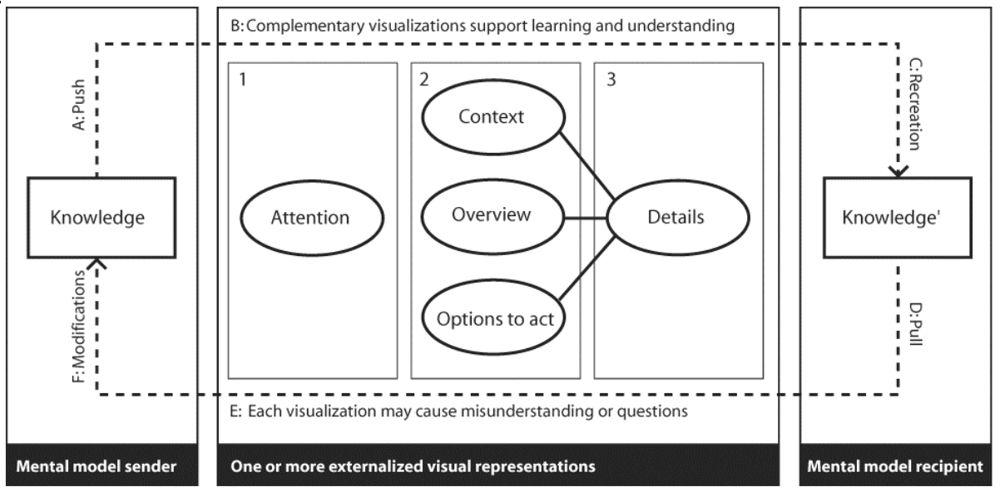
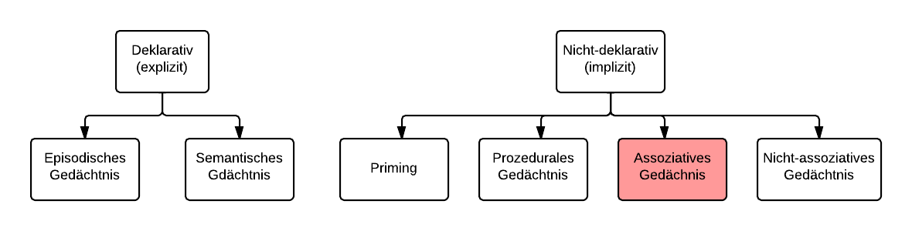

.. _ch-refs:

########################
Kommunikation von Wissen
########################

In dem folgenden Kapitel werden zu Beginn die Begriffe Skizze, Wissen und Ideen
definiert und anschließend ein einheitliches Verständnis für die Kommunikation
von Wissen geschaffen. Das menschliche Gedächnis wird vorgestellt, um mit den
gewonnenen Erkenntnisse den Wert von Skizzen bei der Weitergabe von Wissen
besser einschätzen zu können. 

Skizzen, Wissen und Ideen - Begriffsklärung
===========================================

Martin J. Eppler und Rüdiger Reinhardt bezeichnen Wissen als die Gesamtheit an
Kenntnissen, welche Menschen zur Lösung von Problemen einsetzen und verweisen
dabei auf Probst et. al. 1998 :cite:`reinhardt2004wissenskommunikation`. Auch
das Gabler-Wirtschaftslexikon definiert Wissen als die Gesamtheit der Kenntnisse
und Fähigkeiten, die Individuen zur Lösung von Problemen einsetzen
:cite:`gabler`. Hinzugefügt wird, dass Wissen auf Daten und Informationen
basiert und im Gegensatz zu diesen aber immer an eine Person gebunden ist. In
der Literatur finden sich zum Begriff Wissen zahlreiche Definitionen und
Varianten. Für die Seminararbeit sollen die genannten Definitionen gelten.

Eine Idee ist laut Duden ein Gedanke, eine Vorstellung oder ein guter Einfall
:cite:`duden`. Der Definition von Wissen zufolge kann ein Ideenträger auch als
Wissensträger bezeichnet werden. Er hat die Absicht, sein Wissen zu einem Thema
oder Problem zu kommunizieren und andere von dem Nutzen dieses Einfalls zu
überzeugen. Aufgrund dieser Folgerung wird im Folgenden kein Unterschied in der
Betrachtung der Kommunikation von Wissen und Ideen gemacht. Grundsätzlich
bestehen natürlich gewisse Unterschiede, die in dem vorliegenden Kontext nicht
relevant sind.

In *Welche Gestalt für Wissen* :cite:`eppler2014vergleich` definieren Martin J.
Eppler und Sebastian Kernbach eine Skizze als eine von Hand gezeichnete,
einfache Zeichnung auf einem Flipchart oder einem Blatt Papier. Alternativ kann
diese Zeichnung auch mit Hilfe eines digitalen Stiftes auf einem Tablet oder auf
einem elektronischen, interaktivem Whiteboard entstehen. Diese Definition soll
für die Seminararbeit übernommen werden.

Modell zur Weitergabe von Wissen
================================

.. _knowledge-sharing:

.. figure:: figs/knowledge_sharing.pdf
	:alt: Modell
	:width: 100%
	:align: center
	
	Modell zur Wissensweitergabe. In Anlehnung an Maier, Händrich, Peinl, 2009, S.414 :cite:`maier2005enterprise`

Um spätere Aspekte bei der Kommunikation von Wissen durch die Verwendung von
Notizen und Skizzen besser nachvollziehen zu können, wird die Kommunikation von
Wissen anhand eines Modells vorgestellt. Anschließend wird ein Modell speziell
für die Wissenskommunikation durch Visualisierungen dargestellt.

Das in Abbildung :num:`knowledge-sharing` dargestellte Modell zur
Wissensweitergabe soll zur Veranschaulichung der Kommunikation von Wissen im
Allgemeinen dienen. Entwickelt wurde es von Prof. Dr. René Peinl und ist für die
Verwendung innerhalb dieser Seminararbeit in vereinfachter Form dargestellt. Es
soll lediglich dazu dienen, die Grundprinzipien der Wissenskommunikation zu
verstehen.  Dem Modell zu Folge, beginnt die Wissensweitergabe immer mit einem
Anlass. Eine direkte Frage von Empfänger an Sender oder eine Mitteilung über neu
erlangtes Wissen von Sender an Empfänger stellen beispielsweise einen Anlass
dar. Im nächsten Schritt muss der Sender die Entscheidung treffen, Wissen
weiterzugeben. Um dies tatsächlich tun zu können, muss er sich an das Wissen
erinnern. Bereits an dieser Stelle können Skizzen hilfreich sein, worauf zu
späterem Zeitpunkt detaillierter eingegangen wird. Hat sich der Sender das
Wissen ins Gedächtnis gerufen, muss er es dem Empfänger bereitstellen. Auch an
dieser Stelle können Skizzen hilfreich sein, implizites Wissen (Wissen, das
schwer kommunizierbar ist) zu kommunizieren. Da das Wissen jetzt vorliegt, kann
es über ein Medium an den Empfänger übertragen werden. Im Falle von Notizen und
Skizzen wäre dies beispielsweise Papier oder Whiteboard. Der Empfänger nimmt
diese Informationen mit seinen Sinnen wahr und interpretiert die Inhalte.
Abschließend findet eine Beurteilung und Verknüpfung mit bereits vorhandenem
Wissen statt. Anschließend kann das neue Wissen genutzt und wiederum
weiterkommuniziert werden.

Modell zur Wissenskommunikation durch Visualisierung
====================================================

.. _knowledge-visualication:

	
	Modell zur Wissensweitergabe durch Visualisierung. Burkhard R.A., Meier M.: Tube Map Visualization, S. 12. :cite:`Burkhard_TubeMap`

Remo A. Burkhard und Michael Meier weißen in *Tube Map Visualization*
:cite:`Burkhard_TubeMap` darauf hin, dass für die Kommunikation von Wissen durch
Visualisierungen ein eigenes Modell notwendig ist. Das in Abbildung
:num:`knowledge-visualication` dargestellte Modell ist, wie das eben genannte in
Abbildung :num:`knowledge-sharing` in drei Teile gegliedert. Der Sender, das
Medium und der Empfänger. Diese drei Teile sind laut Burkhard und Meier
verknüpft durch einen Kreislauf aus Kommunikation und Interaktion zwischen
Sender und Empfänger. Der Prozess startet mit dem Sender, der sein Wissen an den
Empfänger übertragen möchte (A). Dieses Wissen wird über Visualisierungen
offengelegt, was in drei Schritte aufgeteilt ist. Der Sender muss die
Aufmerksamheit des Empfängers gewinnen (1), den Inhalt darstellen, einen
Überblick geben und Handlungsempfehlungen aussprechen (2). Im dritten Schritt
kann der Sender auf Details eingehen, was idealerweise im Austausch mit dem
Empfänger geschieht (D). Der Empfänger konstruiert sich durch die
Wissensübermittlung unterstützt durch Visualisierungen sein eigenes Wissen. Es
können Fehlinterpretationen, falsche Annahmen bzw. Folgerungen auftreten (E),
die zu fehlerhaftem Wissen beim Empfänger führen. In diesem Fall wird der Sender
die Visualisierung solange modifizieren, bis der Wissensaustausch erfolgreich
war.

Es kann gefolgert werden, dass bei diesem Modell ein reger Austausch zwischen
Sender und Empfänger vorausgesetzt wird. Nur so kann gewährleistet werden, dass
Fehlinterpretationen auf Seiten des Empfängers erkannt werden und der Sender
nochmals in den Kreislauf des Modells einsteigen muss.

Das menschliche Gedächtnis 
==========================

.. _memory:

	
	Gedächtnisarten, in Anlehnung an Kai Kupferschmidt gehirn.info :cite:`gehirn`.

Kai Kupferschmidt hat unter wissenschaftlicher Betreuung von Prof. Dr. Hans J.
Markowitsch die verschiedenen Formen des Gedächtnisses dargestellt und
erläutert. Er geht dabei auf die beiden Hauptformen, das deklarative (explizite)
und das nicht-deklarative (implizite) Gedächtnis ein. Im episodischen Gedächtnis
werden Erinnerungen an Ereignisse und Erlebnisse gespeichert. Das semantische
Gedächtnis umfasst das gesamte Faktenwissen, z.B. dass die Hauptstadt von
Frankreich Paris ist. Diese beiden Gedächtnisse bilden das deklarative
Gedächtnis. Wissen aus diesem Teil des Gedächnisses ist bewusst abrufbar. Dem
gegenüber steht das nicht-deklarative Gedächtnis. Es besteht aus dem
prozeduralen Gedächtnis, das Fähigkeiten, Gewohnheiten und Verhaltensweisen
speichert. Als Beispiel nennt Kupferschmidt hier das Fahrradfahren. Priming
beschreibt den Vorgang, wenn bekannte Reize dadurch erkannt werden, dass vorher
ein anderer Reiz implizite Gedächtnisinhalte aktiviert hat. Kupferschmidt führt
hier das Beispiel vom Erkennen einer Melodie anhand von wenigen Tönen auf.
Interessant im Zusammenhang mit dem Thema Skizzen ist vorallem das Assoziative
Gedächtnis, das ebenfalls ein Teil des impliziten Gedächtnisses ist. Um neues
Wissen aufnehmen zu können, verknüpft das menschliche Gehirn bereits bestehendes
Wissen mit neuem. Dazu bedient es sich dem Assoziativen Gedächtnis. Skizzen
stellen eine Möglichkeit dar, Wissen, das im impliziten Gedächtnis gespeichert
ist, leichter zu kommunizieren. Auf diese und weitere Eigenschaften und Vorteile
von Skizzen soll im nächsten Kapitel näher eingegangen werden.
