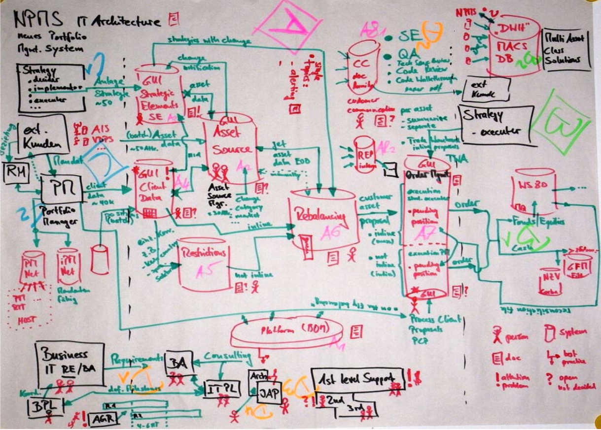

************************
Umsetzung im Unternehmen
************************
Die vorangegangenen Kapitel haben aufgezeigt, welche Vorteile der Einsatz von Skizzen bringt, welche Formen möglich sind und welche Richtlinien eingehalten werden sollten, um Skizzen als effizientes Instrument zur Kommunikation von Wissen einzusetzen.

Im Folgenden soll darauf eingegangen werden, wie Mitarbeiter im Unternehmen dazu motiviert werden können, Skizzen zur Wissenskommunikation einzusetzen. Abschließend werden Praxisbeispiele anhand von Credit Suisse und Asea Brown Boveri vorgestellt.

Mitarbeiter motivieren
======================
Da in der Literatur keine einschlägigen Beispiele vorhanden sind, wie Mitarbeiter speziell zum Einsatz von Skizzen motiviert werden können, wurde ein eigenes Konzept erstellt.
Die Vorteile von Skizzen zur Kommunikation von Wissen dürften jeden Mitarbeiter überzeugen, Skizzen als Instrument zur Kommunikation einzusetzen. Trotzdem dürfte es vielen Mitarbeitern schwer fallen, von bisher gewohnten Kommunikationsmitteln auf Skizzen umzusteigen oder Skizzen in den bisherigen Ablauf einzubauen. Das ist durchaus verständlich, weil in vielen Unternehmensbereichen in den täglichen Arbeitsabläufen wenig Kreativität eingebunden ist. Die Erstellung von Skizzen benötigt jedoch einen gewissen Grad an Kreativität. Diese kann durch Übung und Hilfestellung seitens des Unternehmens geschult werden. Vorgesetzte könnten in zukünftigen Meetings die Inhalte anhand von Skizzen kommunizieren und so die Mitarbeiter von den Vorteilen überzeugen. Die Mitarbeiter selbst sollten eine Schulung erhalten und in den Prozess eingebunden werden. Denkbar wäre es, die einzelnen Abteilungen bei der Entwicklung von einheitlichen Symbolen mit einzubeziehen. Die Mitarbeiter können sich so besser mit dem Konzept identifizieren.

Zahlreiche Unternehmen haben den Stellenwert von Skizzen zur Kommunikation von Wissen erkannt und setzen sie erfolgreich ein. Im Folgenden werden zwei erfolgreiche Projekte aus der Praxis gezeigt.

Wissenskommunikation bei Credit Suisse
======================================
Die Credit Suisse Group, ein weltweit führendes Finanzdienstleistungs-Unternehmen hat für den Wissenstransfer bei anstehendem Mitarbeiterwechsel ein strukturiertes Konzept eingeführt, das unter anderem als Instrument die Skizze verwendet. 

Benno Ackermann, der für Credit Suisse im Wissensmanagement tätig ist, hat das Konzept auf der i-KNOW (International Conference on Knowledge Technologies and Data-driven Business) vorgestellt :cite:`creditSuisse`. Er weist in seinem Vortrag daraufhin, dass im Normalfall durch einen Mitarbeiterwechsel Wissensverlust entsteht. Es geht wertvolles Erfahrungswissen verloren. Das Konzept sieht drei Phasen vor und hat neben der Erhaltung von Wissen im Unternehmen das Ziel, die Einarbeitungszeit eines Nachfolgers um 30% zu kürzen. In der ersten Phase findet die Identifikation des Wissens statt. Aus dieser ersten Phase stammt die Abbildung :num:`map1`. Es ist zu erkennen, dass auch hier einheitliche Zeichen festgelegt wurden. Zu sehen in der rechten unteren Ecke.

.. _map1:

	
	Wissenslandkarte, entstanden in der ersten Phase des Konzepts

In der zweiten Phase wird der Transfer vom Wissen von Person zu Person durchgeführt. Hier wird darauf hingewiesen, dass einer der Schlüsselfaktoren für den Erfolg des Wissenstransfers die Wahl einer massgeschneiderten Methodik für die Moderation ist. Auch hier können Skizzen eingesetzt werden.

In der dritten Phase wird ein sogenanntes Transferdokument erstellt. Das enthält das vom impliziten zum expliziten umgewandelte Wissen.

Credit Suisse hat dieses in Theorie und Praxis erprobte Vorgehen in der Begleitung von mehr als 230 Schlüsselpersonen entwickelt und in der Organisation seit Anfang 2008 eingesetzt.

Arbeitsbereichsgestaltung bei Asea Brown Boveri (ABB)
=====================================================
Asea Brown Boveri ist ein schweizer Konzern aus dem Bereich Energie- und Automatisierungstechnik.
In *Wissen managen* stellen G. Probst, S. Raub und K. Romhardt die Total Quality Management-Initiative vor, die ABB umgesetzt hat :cite:`probst1997wissen`. Innerhalb derer wurde die konsequente Wissensnutzung als ein wesentlicher Erfolgsfaktor betrachtet. Die Gestaltung des Arbeitsplatzes wurde bewusst mit einbezogen. Jede Fertigungsinsel wurde mit einem Whiteboard ausgestattet. Hier wurden die wesentlichen Qualitätsmessgrößen anhand von Skizzen und Post-It's dargestellt. Die Resultate aus regelmäßigen Sitzungen werden in Form von Diagrammen dargestellt und am Whiteboard dokumentiert. Alle Analysen, Maßnahmen und Messgrößen des Fortschritts sind so ständig präsent. Es kann jederzeit auf das am Whiteboard festgehaltene Wissen zurückgegriffen werden.

Das war ein weiteres Beispiel, was zeigt, dass der Einsatz von Notizen und Skizzen im Unternehmen aus vielen Gründen sinnvoll ist. 

